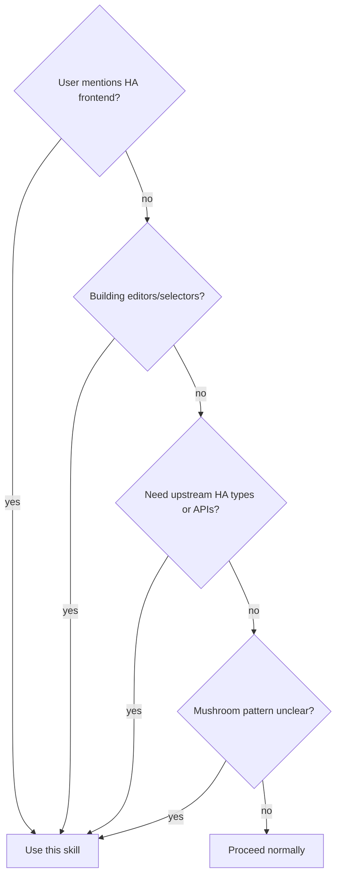

# HA Frontend Reference

Authoritative patterns from the Home Assistant frontend source for equitherm-lovelace development.

## Overview

The HA frontend (`home-assistant/frontend`) is the upstream source of truth for all Lovelace patterns. Use it to find:
- Canonical `ha-form`, `ha-selector`, and editor patterns
- Official theme/design token definitions
- `HomeAssistant` type and `hass` object internals
- WebSocket and data layer patterns
- Shared component APIs (`ha-dialog`, `ha-data-table`, etc.)

## When to Use



## Repository Paths

| What | Path |
|------|------|
| **Repo root** | `/home/p4ult/Projects/Github/frontend/` |
| **Source code** | `/home/p4ult/Projects/Github/frontend/src/` |
| **Dev docs** | `/home/p4ult/Projects/Github/frontend/docs/development/` |
| **File references** | `/home/p4ult/Projects/Github/frontend/docs/development/file-reference/` |

## Documentation Quick Reference

| I Need | Read |
|--------|------|
| Overall architecture | `docs/development/01-architecture.md` |
| Lit patterns, lifecycle, mixins | `docs/development/02-component-development.md` |
| ha-form, selectors, editors | `docs/development/03-editor-development.md` |
| CSS tokens, themes, dark mode | `docs/development/04-styling-theming.md` |
| `hass` object, state flow | `docs/development/05-state-management.md` |
| Reusable components catalog | `docs/development/06-shared-components.md` |
| WebSocket, REST, collections | `docs/development/07-ha-integration.md` |
| i18n, localize | `docs/development/08-translations.md` |
| Testing (Vitest) | `docs/development/09-testing.md` |
| Icons (MDI, ha-icon) | `docs/development/10-icons.md` |

## File References (Deep Dives)

| Source File | Reference Doc |
|-------------|---------------|
| `src/types.ts` | `docs/development/file-reference/types.md` |
| `src/state/connection-mixin.ts` | `docs/development/file-reference/connection-mixin.md` |
| `src/layouts/home-assistant.ts` | `docs/development/file-reference/home-assistant-layout.md` |
| `src/components/ha-form/ha-form.ts` | `docs/development/file-reference/ha-form.md` |
| `src/components/ha-dialog.ts` | `docs/development/file-reference/ha-dialog.md` |
| `src/components/data-table/ha-data-table.ts` | `docs/development/file-reference/ha-data-table.md` |

## Quick Reference (Code)

| I Need | Look At |
|--------|---------|
| `HomeAssistant` type | `src/types.ts` |
| Lovelace card interface | `src/panels/lovelace/types.ts` |
| `ha-form` schema system | `src/components/ha-form/` |
| `ha-selector` implementations | `src/components/ha-selector/` |
| Card editor base | `src/panels/lovelace/editor/` |
| Theme/design tokens | `src/resources/` |
| Shared components | `src/components/` (~350 files) |
| Data layer (WS/REST) | `src/data/` (~158 files) |
| Translation system | `src/translations/` |
| Icon components | `src/components/ha-icon.ts`, `src/components/ha-state-icon.ts` |

## Common Lookup Topics

| Topic | Primary Doc | Source Files |
|-------|------------|--------------|
| **Building a card editor** | 03 - Editor Development | `src/components/ha-form/`, `src/components/ha-selector/` |
| **ha-selector types** | 03 - Editor Development | `src/components/ha-selector/` |
| **Superstruct validation** | 03 - Editor Development | `src/components/ha-form/ha-form.ts` |
| **hass object internals** | 05 - State Management | `src/types.ts`, `src/state/connection-mixin.ts` |
| **CSS design tokens** | 04 - Styling and Theming | `src/resources/` |
| **Dark mode handling** | 04 - Styling and Theming | `src/state/connection-mixin.ts` |
| **WebSocket patterns** | 07 - HA Integration | `src/data/` |
| **Collection/subscription** | 05 + 07 | `src/data/`, `src/mixins/` |
| **Entity types** | 05 - State Management | `src/types.ts` |
| **Lit patterns** | 02 - Component Development | Throughout `src/` |

## equitherm-lovelace vs HA Frontend

| equitherm File | HA Frontend Source of Truth |
|-----------------|---------------------------|
| `src/ha/types.ts` | `frontend/src/types.ts` |
| `src/ha/data/climate.ts` | `frontend/src/data/climate.ts` |
| `src/ha/data/entity.ts` | `frontend/src/data/entity.ts` |
| `src/ha/data/lovelace.ts` | `frontend/src/data/lovelace.ts` |
| `src/ha/panels/lovelace/` | `frontend/src/panels/lovelace/` |
| `src/utils/form/ha-selector.ts` | `frontend/src/components/ha-selector/` |

## Workflow

**When looking for an upstream pattern:**

1. Check the relevant dev doc first (Quick Reference table above)
2. If doc mentions specific source files, read them directly
3. For deep API detail, use the file-reference docs
4. Compare with our vendored copy in `src/ha/` to see what we already have

**When our vendored types are insufficient:**

1. Read the upstream source file in `frontend/src/`
2. Check if the type/pattern we need is already in our `src/ha/`
3. If not, vendor the minimal subset needed
4. Never import directly from `frontend/` -- always vendor into `src/ha/`

## Exploration Methods

| Situation | Method |
|-----------|--------|
| Topic in Quick Reference | **Read doc directly** |
| Need source file API | **Read file-reference doc** |
| Broad question ("how does X work?") | **explore-codebase agent** |
| Find specific component | **Glob** in `frontend/src/components/` |

**Use explore-codebase agent for broad exploration:**

```
Agent: explore-codebase
Path: /home/p4ult/Projects/Github/frontend/
Prompt examples:
- "How does HA implement the ha-selector system?"
- "What Lovelace card interfaces are defined?"
- "How does HA handle theme switching?"
```

**Use Grep/Glob for targeted lookups:**
```bash
# Find a specific component
ls /home/p4ult/Projects/Github/frontend/src/components/ha-selector/

# Search for a type definition
grep -r "LovelaceCard" /home/p4ult/Projects/Github/frontend/src/panels/lovelace/

# Find selector types
ls /home/p4ult/Projects/Github/frontend/src/components/ha-selector/
```

## Notes

- The docs at `docs/development/` are ~6,785 lines of structured reference -- always check them first before reading source
- All file paths in docs are relative to `frontend/` repo root
- HA frontend uses Lit and web components, same as equitherm-lovelace
- When vendoring, strip unnecessary dependencies and keep only what we need
