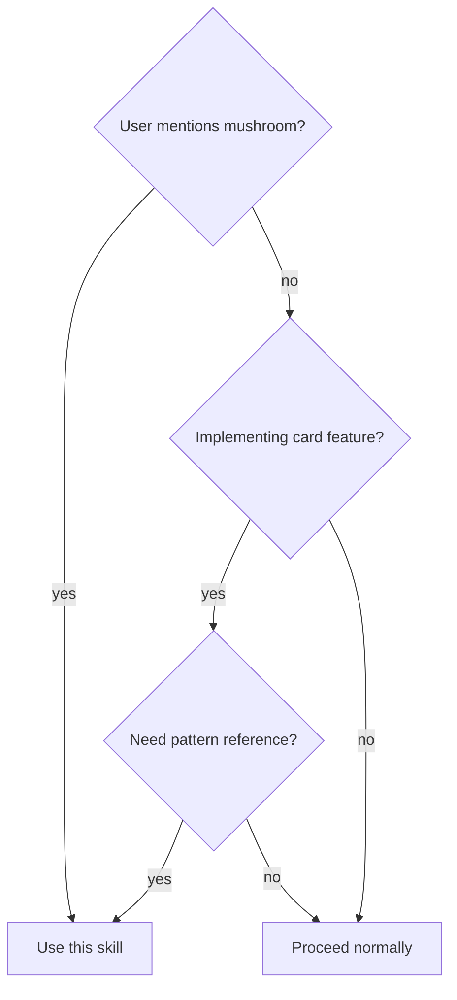

# Mushroom Reference

Reference implementation patterns from lovelace-mushroom for equitherm-lovelace development.

## Overview

lovelace-mushroom is the gold standard for Lovelace custom cards. Use it to find patterns for:
- Card architecture and base classes
- Visual editor implementations
- Theme and color handling
- Action handling (tap/hold/double-tap)
- Superstruct config validation

## When to Use



## Repository Paths

| What | Path |
|------|------|
| **Repo root** | `/home/p4ult/Projects/Github/lovelace-mushroom/` |
| **Source code** | `/home/p4ult/Projects/Github/lovelace-mushroom/src/` |
| **Documentation** | `/home/p4ult/Projects/Github/lovelace-mushroom/docs/` |
| **Card docs** | `/home/p4ult/Projects/Github/lovelace-mushroom/docs/cards/` |
| **Dev guides** | `/home/p4ult/Projects/Github/lovelace-mushroom/docs/development/` |

## Quick Reference (Code)

| I Need | Look At |
|--------|---------|
| Base card pattern | `src/utils/base-card.ts` |
| Icon with shape | `src/shared/shape-icon.ts` |
| Card container | `src/shared/card.ts` |
| Config validation | `src/shared/config/*.ts` |
| Editor UI | `src/utils/lovelace/element-editor.ts` |
| Theme handling | `src/utils/theme.ts` |
| Actions (tap/hold) | `src/ha/panels/lovelace/common/directives/` |
| Badge components | `src/shared/badge-icon.ts` |
| Slider control | `src/shared/slider.ts` |

## Card Structure (Mushroom Pattern)

```
src/cards/<name>-card/
├── <name>-card.ts           # Main component (extends MushroomBaseCard)
├── <name>-card-editor.ts    # Visual editor
├── <name>-card-config.ts    # TypeScript interface + superstruct schema
├── const.ts                 # Element name, supported domains
└── utils.ts                 # Card-specific helpers
```

## Workflow

**When user asks to compare with mushroom:**

1. Identify what to compare (card, component, pattern)
2. Check docs for usage examples (`docs/cards/`, `docs/development/`)
3. Find equivalent code using Quick Reference table
4. Read both files (current project + mushroom)
5. Highlight differences in approach, patterns used
6. Suggest adoption if mushroom pattern is better

**When implementing new feature:**

1. Check mushroom docs for guidance (`docs/`)
2. Check if mushroom has similar feature in code
3. Read their implementation
4. Adapt pattern to equitherm-lovelace context

## Common Comparison Topics

Use explore-codebase agent for these frequent comparisons:

| Topic | What to check |
|-------|---------------|
| **i18n/translations** | `localize.ts`, `src/translations/`, how `localize()` is used |
| **Theme support** | `src/utils/theme.ts`, CSS variable patterns |
| **Dark mode** | How `--dark-mode` or theme changes are detected |
| **Card editors** | `src/utils/lovelace/element-editor.ts`, ha-form usage |
| **State change detection** | `entitiesChanged()` pattern, `updated()` lifecycle |
| **Action handling** | `src/ha/panels/lovelace/common/directives/action-handler.ts` |
| **Config validation** | Superstruct schemas in `*-config.ts` files |

## Common Comparisons (File Mapping)

| equitherm-lovelace | Mushroom equivalent |
|--------------------|---------------------|
| `src/cards/status-card.ts` | `src/cards/entity-card/` or `src/cards/climate-card/` |
| `src/shared/action-badge.ts` | `src/shared/badge-icon.ts` |
| `src/utils/base-card.ts` | `src/utils/base-card.ts` |
| `src/utils/editor.ts` | `src/utils/lovelace/element-editor.ts` |

## Quick Reference (Docs)

| I Need | Look At |
|--------|---------|
| Card usage examples | `docs/cards/<card-name>.md` |
| Development setup | `docs/development/` |
| Badge documentation | `docs/badges/` |

## Exploration Methods

**Choose method based on what you know:**

| Situation | Method |
|-----------|--------|
| Topic listé dans Quick Reference | **Read direct** (chemins connus) |
| Question large ("how does X work?") | **explore-codebase agent** |
| Pas sûr où chercher | **explore-codebase agent** |
| Comparer fichier spécifique | **Read direct** des deux |

**Use explore-codebase agent for broad exploration:**

```
Agent: explore-codebase
Path: /home/p4ult/Projects/Github/lovelace-mushroom/
Prompt examples:
- "How does mushroom handle i18n/translations?"
- "How does mushroom implement theme support?"
```

**Use Grep/Glob for targeted lookups:**
```bash
# Search mushroom code for a pattern
grep -r "pattern_name" /home/p4ult/Projects/Github/lovelace-mushroom/src/

# Search mushroom docs
grep -r "topic" /home/p4ult/Projects/Github/lovelace-mushroom/docs/

# List all mushroom cards
ls /home/p4ult/Projects/Github/lovelace-mushroom/src/cards/

# List card documentation
ls /home/p4ult/Projects/Github/lovelace-mushroom/docs/cards/
```

## Notes

- Both projects use Lit 3
- Both use Superstruct for runtime validation
- Mushroom prefix: `--mushroom-` CSS variables
- Mushroom cards extend `MushroomBaseCard` with `hass`, `_config`, `_stateObj`
