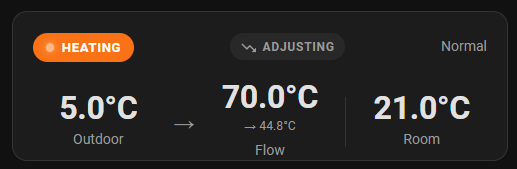
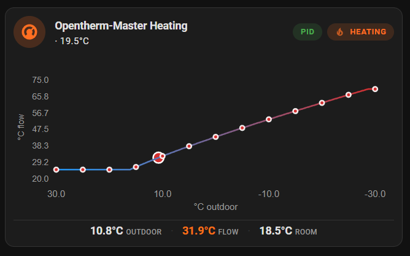

# Equitherm Cards

Home Assistant Lovelace cards for the [ESPHome equitherm climate component](https://github.com/equitherm/core).

 

## Features

- 🛠 Visual editor for all cards
- 🌡 Monitor heating status at a glance
- 📊 Heating curve visualization with customizable gradient
- 🔴 Discrete data points along the curve
- 🌓 Light and dark theme support
- 🌍 Temperature unit conversion (°C/°F)

## Installation

**Home Assistant minimum version:** 2026.3.1

### HACS (Recommended)

[](https://my.home-assistant.io/redirect/hacs_repository/?owner=equitherm&repository=lovelace&category=Dashboard)

_or_

1. Open HACS in Home Assistant
2. Go to "Dashboards"
3. Click the three dots → "Custom repositories"
4. Add `https://github.com/equitherm/lovelace` as type "Dashboard"
5. Click "Install" on "Equitherm Cards"

<details>
<summary>Manual Installation</summary>

1. Download `equitherm-cards.js` from the [latest release][release-url]
2. Copy to `www/equitherm-cards.js` in your Home Assistant config directory
3. Add to your Dashboard resources:
   - **Using UI:** Settings → Dashboards → More Options → Resources → Add Resource
   - Set URL as `/local/equitherm-cards.js` and type as `JavaScript Module`
4. Refresh your browser

</details>

## Cards

### 🌡 Status Card

Compact tile showing current heating status with temperature displays and optional rate-limiting indicators.

```yaml
type: custom:equitherm-status-card
climate_entity: climate.your_equitherm
outdoor_entity: sensor.outdoor_temperature
flow_entity: sensor.flow_setpoint
# Optional:
curve_output_entity: sensor.heating_curve_output
rate_limiting_entity: binary_sensor.rate_limiting_active
pid_active_entity: binary_sensor.pid_active
title: My Heating
layout: default  # default, vertical, or horizontal
```

| Option | Type | Required | Description |
|--------|------|----------|-------------|
| `climate_entity` | string | ✓ | Climate entity with `current_temperature` attribute |
| `outdoor_entity` | string | ✓ | Outdoor temperature sensor |
| `flow_entity` | string | ✓ | Flow setpoint sensor |
| `curve_output_entity` | string | | Shows "ADJUSTING" indicator with target |
| `pid_output_entity` | string | | PID output sensor for rate-limit direction |
| `rate_limiting_entity` | string | | Binary sensor for ramping display |
| `pid_active_entity` | string | | Shows whether PID correction is active |
| `layout` | string | | `default`, `vertical`, or `horizontal` |
| `title` | string | | Card title (defaults to entity friendly name) |

### 📈 Curve Card

Heating curve line chart with horizontal gradient, discrete data points, live operating point, and interactive footer.

```yaml
type: custom:equitherm-curve-card
climate_entity: climate.your_equitherm
outdoor_entity: sensor.outdoor_temperature
curve_output_entity: sensor.heating_curve_output
flow_entity: sensor.flow_setpoint
# Optional:
pid_output_entity: sensor.pid_output
rate_limiting_entity: binary_sensor.rate_limiting_active
pid_active_entity: binary_sensor.pid_active
title: Heating Curve
# Curve parameters (defaults shown):
hc: 0.9
n: 1.25
shift: 0
min_flow: 20
max_flow: 70
t_out_min: -20
t_out_max: 20
```

| Option | Type | Required | Description |
|--------|------|----------|-------------|
| `climate_entity` | string | ✓ | Climate entity with temperature setpoint |
| `outdoor_entity` | string | ✓ | Outdoor temperature sensor |
| `curve_output_entity` | string | ✓ | Curve output temperature sensor |
| `flow_entity` | string | ✓ | Current flow setpoint sensor |
| `pid_output_entity` | string | | PID output sensor for rate-limit direction |
| `rate_limiting_entity` | string | | Binary sensor for rate limiting |
| `pid_active_entity` | string | | Shows whether PID correction is active |
| `title` | string | | Card title (defaults to entity friendly name) |
| `hc` | number | | Heat curve coefficient (default: 0.9) |
| `n` | number | | Curve exponent (default: 1.25) |
| `shift` | number | | Temperature offset in °C (default: 0) |
| `min_flow` | number | | Minimum flow temperature (default: 20) |
| `max_flow` | number | | Maximum flow temperature (default: 70) |
| `t_out_min` | number | | Outdoor temp range minimum (default: -20) |
| `t_out_max` | number | | Outdoor temp range maximum (default: 20) |

### Planned Cards

| Card | Description |
|------|-------------|
| 🌤 **Forecast Card** | Predicted flow temperatures from weather forecast |
| 🔧 **Tuning Card** | Compare heating curves and tune parameters live |

## Requirements

- Home Assistant 2026.3.1 or later
- [ESPHome equitherm climate component](https://github.com/equitherm/core) configured

## Related Projects

- [equitherm/core](https://github.com/equitherm/core) - Pure calculation library
- [equitherm/web](https://github.com/equitherm/web) - Web-based tuning tool

## Development

```bash
pnpm install     # Install dependencies
pnpm dev         # Start Rollup watch mode
pnpm build       # Build bundle to dist/
```

See [CLAUDE.md](CLAUDE.md) for development guidelines.

## License

MIT
