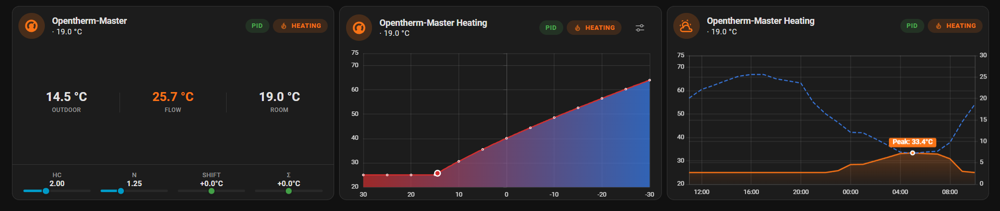

# Equitherm Cards

[![hacs][hacs-badge]][hacs-url]
[![release][release-badge]][release-url]
![downloads][downloads-badge]
![build][build-badge]
[![license][license-badge]][license-url]

[](https://my.home-assistant.io/redirect/hacs_repository/?owner=equitherm&repository=lovelace&category=frontend)

<!-- Hero screenshot — layout: status full-width top + 3 charts below -->


A collection of Lovelace cards for the [ESPHome equitherm climate component][equitherm-core]. Monitor heating status, visualize heating curves, forecast demand, and tune parameters — directly from your Home Assistant dashboard.

[equitherm-core]: https://github.com/equitherm/core

## Features

- **Status Card** — Live temperatures, HVAC state, PID diagnostics, WWSD indicator
- **Curve Card** — Interactive heating curve with operating point marker and tuning mode
- **Forecast Card** — Weather-based flow temperature prediction
- Visual editor for all cards — no manual YAML required
- Light and dark theme support
- Automatic temperature unit conversion (°C/°F)

## Installation

### HACS (recommended)

[](https://my.home-assistant.io/redirect/hacs_repository/?owner=equitherm&repository=lovelace&category=frontend)

_or_

1. Open HACS in Home Assistant
2. Search for "Equitherm Cards"
3. Click Download

### Manual

1. Download `equitherm-cards.js` from the [latest release][release-url]
2. Place it in your `config/www/` folder
3. Add as a dashboard resource:
   - **UI:** Settings → Dashboards → Resources → Add → `/local/equitherm-cards.js` (JavaScript Module)
   - **YAML:**
     ```yaml
     resources:
       - url: /local/equitherm-cards.js
         type: module
     ```

## Cards

- :thermometer: [Status Card](docs/cards/status-card.md) — Temperature readings, PID diagnostics, HVAC badge
- :chart_with_upwards_trend: [Curve Card](docs/cards/curve-card.md) — Heating curve visualization with tuning mode
- :partly_sunny: [Forecast Card](docs/cards/forecast-card.md) — Weather-based flow prediction

| Card | Type |
|------|------|
| Status | `custom:equitherm-status-card` |
| Curve | `custom:equitherm-curve-card` |
| Forecast | `custom:equitherm-forecast-card` |

## Quick Start

```yaml
type: custom:equitherm-status-card
climate_entity: climate.equitherm
outdoor_entity: sensor.outdoor_temperature
flow_entity: sensor.flow_setpoint
```

## Development

Prerequisites: Node.js 22+, pnpm 10+

```bash
pnpm install
pnpm dev              # Start Rollup watch mode
ha -c .hass_dev start # Start local Home Assistant instance
```

See [CONTRIBUTING.md](CONTRIBUTING.md) for guidelines.

## License

MIT — see [LICENSE](LICENSE) for details.

<!-- Badge references -->
[hacs-url]: https://hacs.xyz
[hacs-badge]: https://img.shields.io/badge/hacs-default-orange.svg?style=flat-square
[release-badge]: https://img.shields.io/github/v/release/equitherm/lovelace?style=flat-square
[release-url]: https://github.com/equitherm/lovelace/releases
[downloads-badge]: https://img.shields.io/github/downloads/equitherm/lovelace/total?style=flat-square
[build-badge]: https://img.shields.io/github/actions/workflow/status/equitherm/lovelace/ci.yml?branch=main&style=flat-square
[license-badge]: https://img.shields.io/github/license/equitherm/lovelace?style=flat-square
[license-url]: https://github.com/equitherm/lovelace/blob/main/LICENSE
[hacs]: https://hacs.xyz
